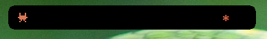
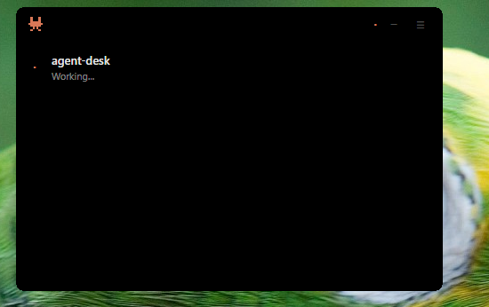

# Agent Desk

[English](#agent-desk) | [中文](README_CN.md)

Universal CLI agent monitor — a desktop Dynamic Island widget for [Claude Code](https://docs.anthropic.com/en/docs/claude-code), [Codex CLI](https://github.com/openai/codex), and future coding agents.


## Features

- **Dynamic Island** — always-on-top pill at screen top, expands on hover to show sessions
- **Multi-agent monitoring** — tracks all running Claude Code / Codex sessions simultaneously
- **Permission approval** — approve or deny tool calls directly from the widget (no terminal switching)
- **Real-time updates** — SSE-based live status (working / ready / waiting for input)
- **System tray** — dynamic icon, session list, toast notifications, per-event sound alerts
- **Global hotkey** — configurable shortcut (default `Alt+D`) to show/hide the island
- **Autostart** — optional boot-time launch via OS-level autostart
- **Remote push** — Telegram / DingTalk / WeChat notifications (optional)

## Screenshots

| Dynamic Island (collapsed) | System Tray Menu |
|:---:|:---:|
|  |  |

## Quick Start

### Option A: Install from Release (recommended)

1. Download the `.msi` or `-setup.exe` installer from [Releases](https://github.com/ZAKERR/agent-desk/releases)
2. Run the installer
3. Launch Agent Desk

That's it. On first launch the app auto-configures Claude Code hooks in `~/.claude/settings.json` — no manual setup needed.

### Option B: Build from Source

#### Prerequisites

- Windows 10/11
- [Rust](https://rustup.rs/) toolchain (includes `cargo`)
- [Claude Code](https://docs.anthropic.com/en/docs/claude-code) or [Codex CLI](https://github.com/openai/codex)

#### Build & Run

```bash
# 1. Build the hook binary
cd hooks && cargo build --release && cd ..

# 2. Copy hook binary next to the main exe (required for auto-configure)
mkdir -p src-tauri/binaries
cp hooks/target/release/agent-desk-hook.exe src-tauri/binaries/

# 3. Build the main app
cd src-tauri && cargo build --release && cd ..

# 4. Copy hook binary next to the built exe
cp hooks/target/release/agent-desk-hook.exe src-tauri/target/release/

# 5. Run
src-tauri/target/release/agent-desk.exe
```

On first launch:
- `config/config.yaml` is auto-created from the example template
- `~/.claude/settings.json` is auto-configured with hook entries (if `agent-desk-hook.exe` is found next to the main exe)

#### Manual Hook Configuration (only if auto-configure doesn't apply)

If you place the hook binary elsewhere, add to `~/.claude/settings.json`:

```json
{
  "hooks": {
    "UserPromptSubmit": [{ "hooks": [{ "type": "command", "command": "C:/path/to/agent-desk-hook.exe --event user_prompt" }] }],
    "PreToolUse": [{ "hooks": [{ "type": "command", "command": "C:/path/to/agent-desk-hook.exe --event pre_tool" }] }],
    "Stop": [{ "hooks": [{ "type": "command", "command": "C:/path/to/agent-desk-hook.exe --event stop" }] }],
    "Notification": [{ "hooks": [{ "type": "command", "command": "C:/path/to/agent-desk-hook.exe --event notification" }] }],
    "SessionStart": [{ "hooks": [{ "type": "command", "command": "C:/path/to/agent-desk-hook.exe --event session_start" }] }],
    "SessionEnd": [{ "hooks": [{ "type": "command", "command": "C:/path/to/agent-desk-hook.exe --event session_end" }] }]
  }
}
```

> **Important**: Use forward slashes (`C:/path/to/...`) in hook paths. Claude Code executes hooks via bash, which strips backslashes.

## Configuration

Config file: `config/config.yaml` (auto-created from `config.example.yaml`)

Config search order: exe directory > working directory > `%APPDATA%/agent-desk/`

### Key settings

| Section | Key | Default | Description |
|---------|-----|---------|-------------|
| `island` | `hotkey` | `"Alt+D"` | Global show/hide shortcut |
| `island` | `autostart` | `false` | Launch on system boot |
| `island` | `sound_enabled` | `true` | Play sounds on events |
| `island` | `sound_stop` | `"asterisk"` | Sound for task completion |
| `island` | `sound_notification` | `"exclamation"` | Sound for input requests |
| `island` | `sound_permission` | `"question"` | Sound for permission prompts |
| `telegram` | `enabled` | `false` | Telegram push notifications |
| `dingtalk` | `enabled` | `false` | DingTalk push notifications |
| `wechat` | `enabled` | `false` | WeChat push notifications |

All settings can also be changed from the island's built-in Settings panel.

## Architecture

```
Hook events ──> agent-desk-hook.exe ──> HTTP API (port 15924)
                                              │
                                    ┌─────────┼─────────┐
                                    │         │         │
                              SessionTracker  SSE    EventLog
                                    │         │         │
                              ProcessScanner  │    Remote Push
                                    │         │
                              ┌─────┴─────────┴──────┐
                              │    Dynamic Island     │
                              │  (always-on-top pill) │
                              └───────────────────────┘
```

## FAQ

### Hook errors: `agent-desk-hook.exe: command not found`

Hook paths **must use forward slashes** (`C:/Program Files/Agent Desk/agent-desk-hook.exe`). Claude Code runs hooks via bash, which interprets backslashes (`\`) as escape characters and silently strips them. The auto-configure already handles this, but if you set paths manually, always use `/`.

### Island stuck on "Working..." after Claude Code finishes

Agent Desk didn't receive the `Stop` hook event. Common causes:
- Hook binary not found (see error above)
- Agent Desk is not running when Claude Code finishes
- Port 15924 is blocked by firewall

Check `~/.claude/settings.json` has all 6 hook events configured. You can also verify manually:
```bash
echo '{}' | agent-desk-hook.exe --event stop
```

### "Agent Desk is already running on port 15924"

Only one instance can run at a time. Either close the existing one (system tray → Quit) or kill it:
```bash
taskkill /F /IM agent-desk.exe
```

### Hooks not auto-configured after install

Auto-configure requires `agent-desk-hook.exe` to be in the same directory as the main `agent-desk.exe`. Check:
1. Both files exist in the install directory
2. `~/.claude/` directory is writable
3. Check `~/.claude/settings.json` for a `hooks` section

### Island disappeared / not visible

- Press `Alt+D` (default hotkey) to toggle visibility
- Right-click the system tray icon → "Show Island"
- The island hides when another app takes focus in expanded mode — hover the pill area at the top center of your screen

### No sessions showing in the island

- Ensure Claude Code (or Codex) is actually running
- Hooks must be configured — check `~/.claude/settings.json`
- Start a new Claude Code session after Agent Desk is running (existing sessions won't appear until they fire a hook event)

### Permission approval not working

The `PermissionRequest` hook requires separate setup (not auto-configured). Add to `~/.claude/settings.json`:
```json
"PermissionRequest": [{ "hooks": [{ "type": "command", "command": "C:/path/to/agent-desk-hook.exe --event permission_request", "timeout": 86400 }] }]
```

### Source build: `cargo: command not found`

Cargo isn't in the default bash PATH. Prefix your commands:
```bash
export PATH="$HOME/.cargo/bin:$PATH"
cargo build --release
```

### Source build: file lock error during rebuild

The running exe is locked by Windows. Kill it first:
```bash
taskkill /F /IM agent-desk.exe
cd src-tauri && cargo build --release
```

### Port 15924 conflict with another application

Edit `config/config.yaml` and change the `port` value under `manager`. Also update your hook binary's port flag:
```json
"command": "agent-desk-hook.exe --event stop --port 15925"
```

## Acknowledgments

- UI concept inspired by Apple's [Dynamic Island](https://support.apple.com/guide/iphone/use-the-dynamic-island-iph28f50d10d/ios)
- Architecture design and technology choices referenced from [claude-island](https://github.com/farouqaldori/claude-island) by [@farouqaldori](https://github.com/farouqaldori)

## License

MIT
